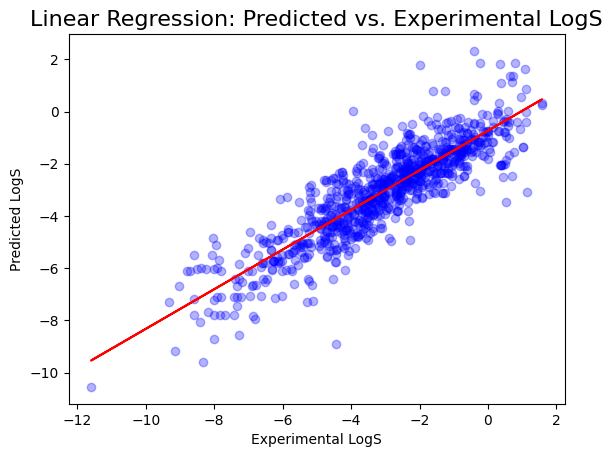
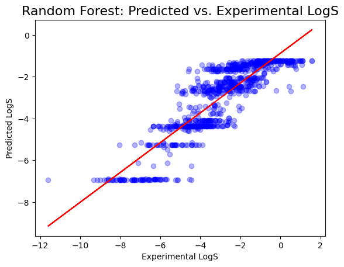

# My First ML Model Project: Predicting Drug Solubility! 🧪✨

Hey there, fellow data adventurers! 👋

This is my very first machine learning project, and I'm super excited to share it with you! 🎉 We're diving into the fascinating world of drug solubility prediction using the Delaney Solubility dataset.

## What's This All About? 🤔

In the world of pharmaceuticals, knowing how well a drug dissolves (its solubility) is crucial. This project aims to build machine learning models that can predict the solubility of compounds based on their molecular descriptors. We'll be using:

* **Linear Regression:** A classic and straightforward method.
* **Random Forest Regression:** A powerful ensemble technique.

## The Data 📊

We're using the Delaney Solubility dataset, which contains experimental solubility data and molecular descriptors for a bunch of compounds.

**Credit:** This dataset was originally compiled by John S. Delaney.

You can find the dataset here: [Delaney Solubility with Descriptors](https://raw.githubusercontent.com/dataprofessor/data/refs/heads/master/delaney_solubility_with_descriptors.csv)

## How It Works 🛠️

1.  **Data Loading and Preprocessing:** We load the dataset using pandas, separate the features (molecular descriptors) from the target (solubility), and split the data into training and testing sets.
2.  **Model Training:** We train both a Linear Regression model and a Random Forest Regression model on the training data.
3.  **Prediction and Evaluation:** We use the trained models to predict solubility on both the training and testing sets. Then, we evaluate the models' performance using Mean Squared Error (MSE) and R-squared (R2) scores.
4.  **Visualization:** We create scatter plots to visualize the predicted vs. experimental LogS values for both models.

## Results 📈

Here's a sneak peek at the model performance:

| # | Method                   | Train MSE | Train R2 | Test MSE | Test R2 |
|---|--------------------------|-----------|----------|----------|---------|
| 1 | Linear Regression        | 0.260579  | 0.772583 | 0.270966 | 0.781844|
| 2 | Random Forest Regression | 0.479532  | 0.581561 | 0.505035 | 0.603358|

As you can see, Linear Regression performed better on this data set.

## Visualizing the Magic ✨

Here's a glimpse of the predicted vs. experimental LogS plots:

### Linear Regression



### Random Forest



## Getting Started 🚀

To run this project on your local machine, follow these steps:

1.  **Clone the Repository:**

    ```bash
    git clone [your-repo-url]
    cd [your-repo-directory]
    ```

2.  **Install Dependencies:**

    ```bash
    pip install pandas scikit-learn matplotlib numpy
    ```

3.  **Run the Script:**

    ```bash
    python your_script_name.py
    ```

## Let's Connect! 🤝

Feel free to fork this repository, play around with the code, and let me know what you think! I'm always eager to learn and improve.

Happy coding! 💻✨